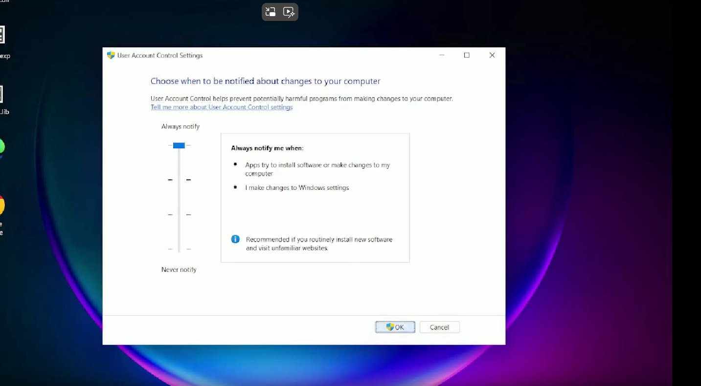

# FUD UAC Bypass – DLL Side-Loading Exploit  
# FROM USER TO SYSTEM

##  Overview  
demonstratetion a **Fully Undetectable (FUD) UAC Bypass** technique leveraging **DLL Side-Loading**. It works on **Windows 10 & 11**, allowing privilege escalation without triggering UAC prompt.

Checking UAC:
```cmd
reg query HKLM\Software\Microsoft\Windows\CurrentVersion\Policies\System /v EnableLUA
```

## 🎯 Features    
- **Fully Undetectable (FUD)** – Evades modern security solutions, such as winows defender, avast, kaspersky, etc.  
- **Cross-Compatible** – Works on **Windows 10 & 11**.  
- **Multi-Language Development** – Written in **C++ & Python**.  
- **Automated Execution** – Seamless execution for privilege escalation.  
 
  
  ## 🛒 Buy:  
🔹 **Contact me: https://t.me/mstr_and3rs0n** u will resive full sourse code and help with building, and free test if u need

##  PROOF ON WIN11 (from user to system)


https://github.com/user-attachments/assets/1d710dd1-ac73-4e7e-8be7-12a3608b65fb


An exploit is also available for bypassing UAC at the "Always Notify" level.

Works on Windows 10 & 11.

Tested with Kaspersky AV and Windows Defender (FUD). Can bypass almost all AV & EDR

I can send a test version before purchase, so you can run your own tests with the target AV.

[](https://files.catbox.moe/rucons.mp4)


